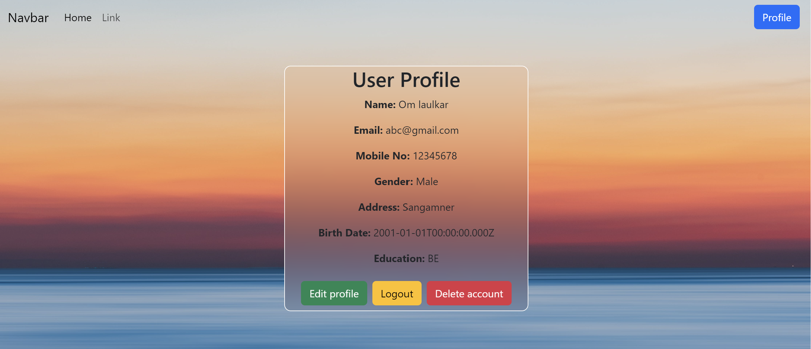

# profile-app
## Overview


This project is a web application for managing user profiles. It includes features such as user registration, login, profile viewing, updating, and account deletion.

## Technologies Used


- **Frontend:** React.js
- **Backend:** Node.js, Express.js
- **Database:** MongoDB
- **Authentication:** JSON Web Tokens (JWT)
- **Styling:** CSS, Bootstrap

## Features


1. **User Registration and Login:** Allow users to create accounts and log in securely.
2. **Profile Management:** View, update, and delete user profiles.
3. **Protected Routes:** Certain routes are protected and accessible only when logged in.
4. **Responsive Design:** Ensure a seamless experience across different devices.

## Folder Structure


- **client:** React frontend
- **server:** Node.js/Express backend
- **database:** MongoDB database connection

## Setup Instructions


1. Clone the repository:

   ```bash
   git clone https://github.com/your-username/your-project.git
   ```

2. Install dependencies:

   ```bash
   cd your-project
   cd client && npm install
   cd ../server && npm install
   ```

3. Run the application:

   ```bash
   cd client && npm start
   cd ../server && npm start
   ```

   Access the app at [http://localhost:3000](http://localhost:3000).

## Usage


- Register a new user account.
- Log in with the registered credentials.
- View and update your profile information.
- Delete your account if needed.

## API Endpoints


- **POST /abc/register:** Register a new user.
- **POST /abc/login:** Log in a user.
- **GET /abc/findall:** Get all user profiles.
- **GET /abc/findone/:email:** Find a user by email.
- **PUT /abc/update/:email:** Update user profile by email.
- **DELETE /abc/delete/:email:** Delete user account by email.

## Screenshots




## Future Enhancements


- Implement email verification during registration.
- Add user roles and permissions for enhanced security.

## Contributions


Contributions are welcome! Please follow the [contribution guidelines](CONTRIBUTING.md).

## License


This project is licensed under the [MIT License](LICENSE).

Make sure to replace placeholder values such as `your-username`, `your-project`, and adjust the content based on the specifics of your project. Additionally, consider adding more details based on your project's unique characteristics.
